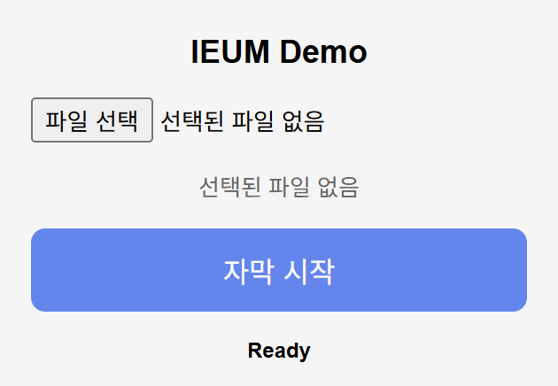
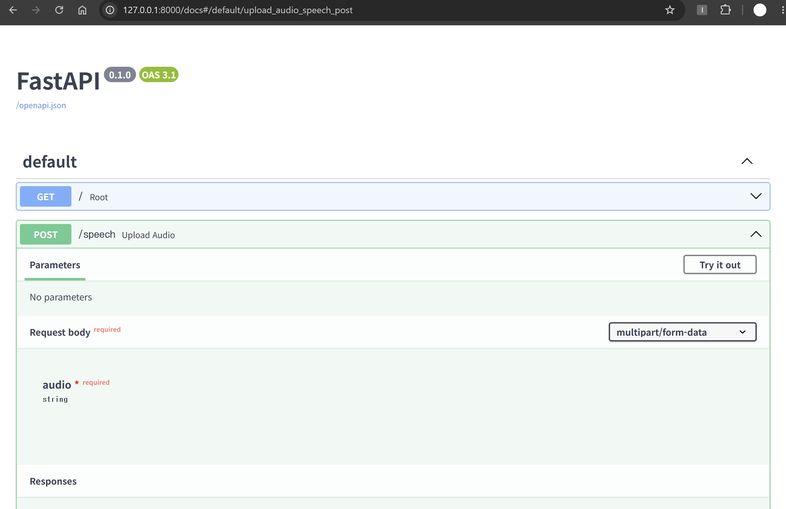
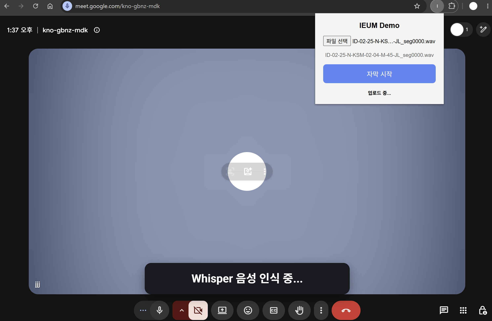
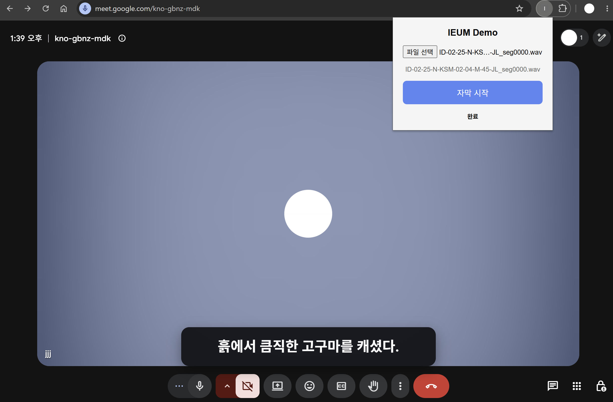
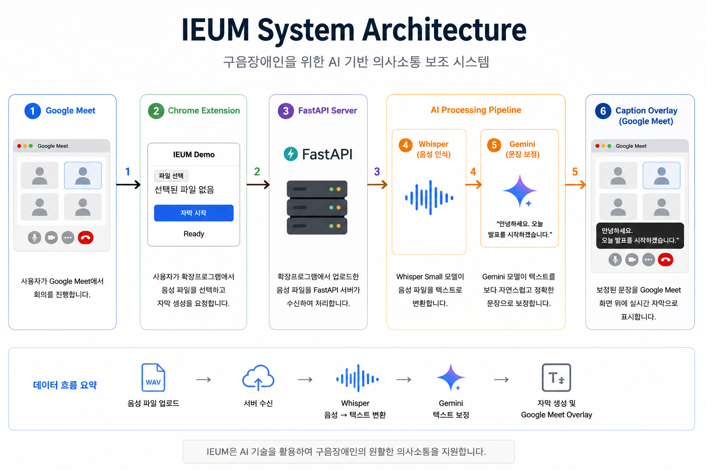
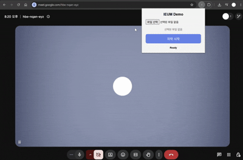

# IEUM (이음)

## 구음장애인을 위한 AI 기반 의사소통 보조 시스템

### 프로젝트 소개

IEUM은 구음장애인의 의사소통을 지원하기 위한 AI 기반 자막 생성 시스템입니다.

사용자가 발화한 음성을 Whisper를 이용하여 텍스트로 변환한 뒤, Gemini를 이용하여 보다 자연스러운 문장으로 보정하고, Google Meet 화면에 실시간 자막 형태로 출력하는 것을 목표로 합니다.

현재는 실제 마이크 입력 대신 테스트용 WAV 파일을 이용하여 전체 파이프라인을 구현하였습니다.

---

# System Pipeline

```text
Google Meet

↓

Chrome Extension

↓

WAV File

↓

FastAPI

↓

Whisper Small

↓

Gemini

↓

Google Meet Caption Overlay
```

---

# Features

* Chrome Extension 기반 Google Meet 연동
* FastAPI 기반 AI 추론 서버
* Whisper Small 음성 인식
* Gemini 문장 보정
* Google Meet Overlay 자막 출력
* WAV 파일 업로드 기반 데모 구현

---

# Project Structure

```text
ieum_demo/

backend/
    main.py
    whisper_model.py
    gemini_model.py

extension/
    manifest.json
    popup.html
    popup.js
    background.js
    content.js
    style.css

sample_audio/
    sample1.wav
    sample2.wav

README.md
requirements.txt
.gitignore
```

---

# Tech Stack

### Backend

* FastAPI
* Python

### AI

* Whisper Small
* Google Gemini

### Frontend

* Chrome Extension (Manifest V3)
* HTML
* CSS
* JavaScript

---

# Installation

## 1. Clone Repository

```bash
git clone <repository_url>
cd Project_ieum
```

> **Note**
> Repository를 clone하면 `Project_ieum` 폴더가 생성됩니다.

---

## 2. Create Virtual Environment

Python **3.10 이상**을 권장합니다.

```bash
py -3.11 -m venv venv
```

### Activate Virtual Environment

**Git Bash**

```bash
source venv/Scripts/activate
```

**PowerShell**

```powershell
venv\Scripts\Activate.ps1
```

가상환경이 활성화되면 터미널 앞에 `(venv)`가 표시됩니다.

---

## 3. Install Dependencies

```bash
pip install -r requirements.txt
```

> **Note**
>
> `fastapi==0.138.1` 설치 오류가 발생하면 Python 버전이 3.10 미만인 경우입니다.
> Python 3.10 이상으로 가상환경을 다시 생성한 후 설치를 진행하세요.

---

# Run

## 1. Start FastAPI Server

```bash
cd backend
uvicorn main:app --reload
```

정상적으로 실행되면 다음과 같은 로그가 출력됩니다.

```text
INFO: Uvicorn running on http://127.0.0.1:8000
INFO: Application startup complete.
```

> `google.generativeai` 관련 `FutureWarning`은 실행에 영향을 주지 않는 경고 메시지이므로 무시해도 됩니다.

---

## 2. Load Chrome Extension

1. Chrome에서 `chrome://extensions` 접속
2. 개발자 모드 활성화
3. **압축해제된 확장 프로그램 로드**
4. `extension` 폴더 선택

---

## 3. Run Demo

1. Google Meet 접속
2. 우측 상단 확장 프로그램 아이콘 클릭
3. Popup에서 WAV 파일 선택
4. **자막 시작(Start Subtitle)** 버튼 클릭

---

## 4. Stop Server

FastAPI 서버 종료

```text
Ctrl + C
```

---

# Result

최종 처리 과정

```text
Google Meet

↓

Chrome Extension

↓

FastAPI

↓

Whisper Small

↓

Gemini

↓

Caption Overlay
```

Google Meet 화면 위에 자연어로 보정된 자막을 Overlay 형태로 출력한다.

---

# Future Work

* 실시간 마이크 입력 지원
* WebSocket 기반 실시간 스트리밍
* TTS(Text-to-Speech) 기능 추가
* Chrome Extension 기능 개선
* 실시간 회의 환경 최적화

---

# Demo

### Chrome Extension

사용자는 Google Meet에서 IEUM Chrome Extension을 실행한 후, WAV 음성 파일을 선택하여 자막 생성을 요청할 수 있습니다.

<p align="center">
  
</p>

---

### FastAPI Backend

Chrome Extension으로부터 전송된 음성 파일은 FastAPI 서버에서 수신되며, `/speech` API를 통해 Whisper와 Gemini 파이프라인이 실행됩니다.

<p align="center">
  
</p>

---

### Caption Generation

음성 파일이 업로드되면 Whisper가 음성을 텍스트로 변환하고, Gemini가 문장을 자연스럽게 보정합니다. 처리 과정은 Google Meet 화면에서 상태 메시지로 확인할 수 있습니다.

<p align="center">
  
</p>

---

### Final Result

최종적으로 보정된 문장은 Google Meet 화면 위에 Caption Overlay 형태로 출력됩니다.

<p align="center">
  
</p>

---

### System Architecture

전체 시스템의 데이터 흐름은 다음과 같습니다.

<p align="center">
  
</p>

---

# Presentation & Demo

프로젝트 발표 자료와 데모 영상을 확인할 수 있습니다.

## Presentation

- [IEUM Presentation (PDF)](docs/ieum_presentation.pdf)

## Demo

아래는 IEUM 시스템의 실제 실행 화면입니다.

<p align="center">
  
</p>
