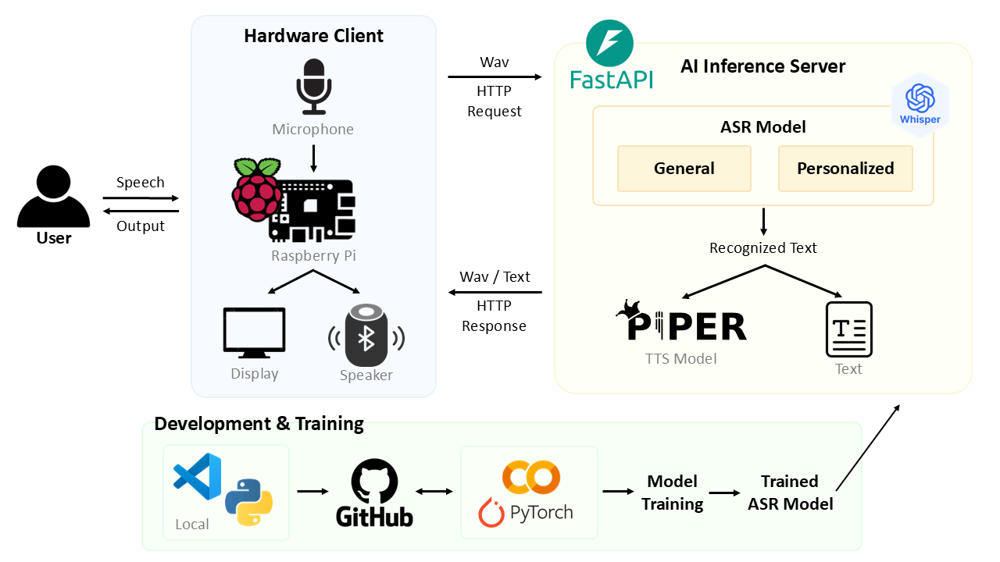
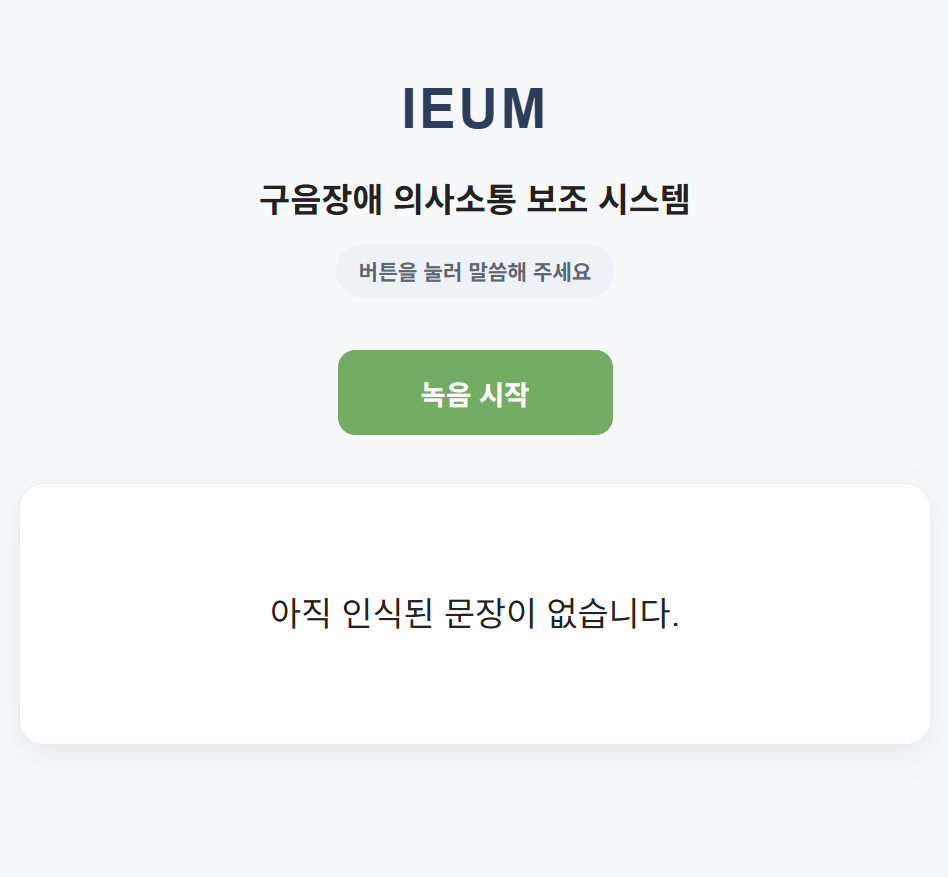
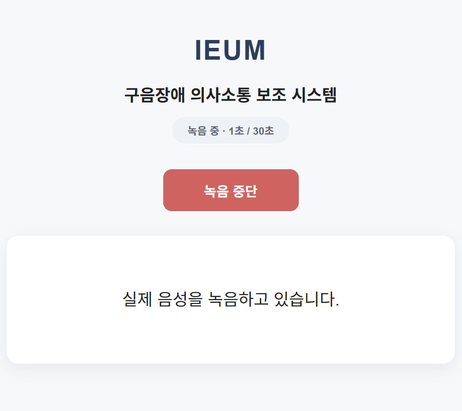
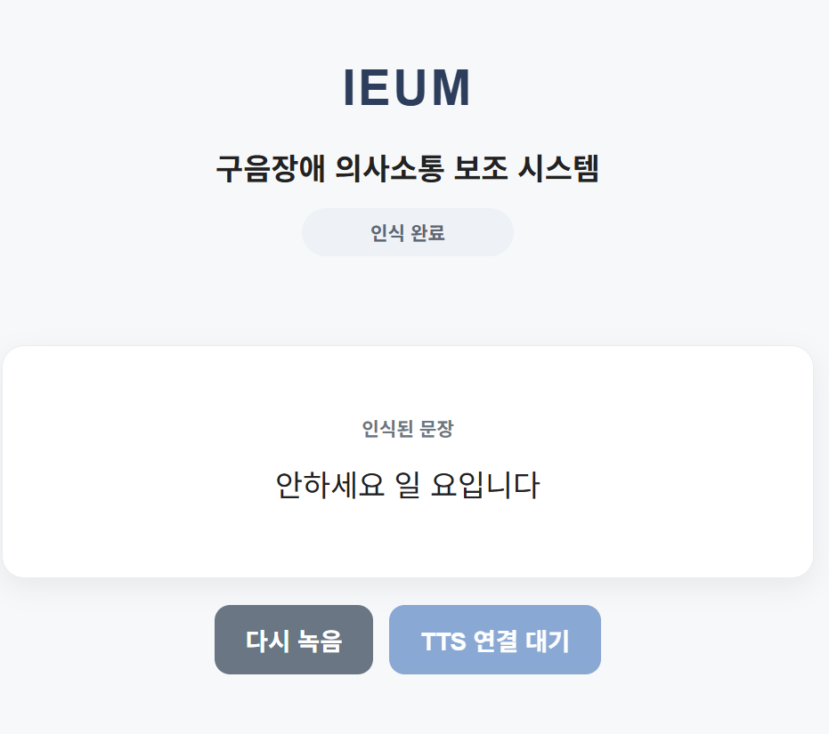

# 이음 (IEUM)

> **구음장애 화자를 위한 개인화 음성 인식 및 의사소통 보조 시스템**

이음(IEUM)은 구음장애 화자의 음성을 보다 정확하게 인식하고, 인식된 문장을 다시 음성으로 전달하여 의사소통을 보조하기 위한 **개인화 음성 인식 시스템**입니다.

<br>

## 📌 Project Information

* **소속**: 덕성여자대학교 인공지능 동아리 **시냅스(SYNAPSE)**
* **개발 과정**

  * **학기 중**: 구음장애 음성 데이터 전처리 및 기본 ASR 파이프라인 구축
  * **2026.06.29 ~ 2026.08.24**: 범용·개인화 ASR 모델 개발 및 실험, FastAPI 서버와 Raspberry Pi 기반 하드웨어 연동

<br>

## 👥 Team

<table>
  <tr>
    <td align="center">
      <br>
      <b>김유리</b><br>
      디지털소프트웨어공학부<br>
      <a href="https://github.com/yoyoori">GitHub</a>
    </td>
    <td align="center">
      <br>
      <b>명지민</b><br>
      디지털소프트웨어공학부<br>
      <a href="https://github.com/jimin414">GitHub</a>
    </td>
    <td align="center">
      <br>
      <b>김연수</b><br>
      디지털소프트웨어공학부<br>
      <a href="https://github.com/aichikra">GitHub</a>
    </td>
    <td align="center">
      <br>
      <b>이유림</b><br>
      데이터사이언스학과<br>
      <a href="https://github.com/lllyyy-y">GitHub</a>
    </td>
  </tr>
  <tr>
    <td align="center">
      Forced Alignment · Segmentation<br>
      범용/개인화 ASR 모델 개발
    </td>
    <td align="center">
      데이터 구축 및 분석<br>
      범용 ASR 모델 개발
    </td>
    <td align="center">
      FastAPI · Piper TTS<br>
      ASR-TTS 파이프라인 및 하드웨어 설계
    </td>
    <td align="center">
      Raspberry Pi 음성 입출력<br>
      서버 통신 · UI · End-to-End 통합
    </td>
  </tr>
</table>

<br>

## 🔎 Overview

일반적인 음성 인식 모델은 정상 발화 데이터를 중심으로 학습되어 있어 **구음장애 화자의 비정형적인 발음과 화자별 발화 특성을 정확하게 인식하는 데 한계**가 있습니다.

또한 구음장애 음성은 같은 장애 유형에서도 화자에 따라 발음 특성과 반복적으로 나타나는 오류 패턴이 다르기 때문에, 하나의 범용 음성 인식 모델만으로 모든 화자의 특성을 충분히 반영하기 어렵습니다.

**이음(IEUM)**은 이러한 문제를 개선하기 위해 구음장애 음성에 적응한 **범용 ASR 모델**을 구축하고, 화자별로 반복되는 인식 오류를 분석한 **Error Profile 기반 개인화 ASR 모델**로 확장했습니다.

최종적으로 Raspberry Pi 기반 하드웨어와 FastAPI 추론 서버를 연결하여 다음 과정을 하나의 End-to-End 시스템으로 구현했습니다.

**음성 입력 → 범용·개인화 ASR → 텍스트 출력 → Piper TTS → Bluetooth 스피커 출력**

<br>

## 🏗️ System Architecture

<p align="center">
  
</p>

Raspberry Pi는 USB 마이크와 GPIO 버튼을 이용해 사용자의 음성을 녹음하고 FastAPI 서버로 전달합니다.

FastAPI 서버에서는 범용 ASR과 해당 화자의 개인화 ASR 모델을 이용해 음성을 인식하며, 두 모델의 결과를 Raspberry Pi 디스플레이에서 비교할 수 있습니다.

사용자가 개인화 모델의 결과를 선택하면 Piper TTS를 통해 다시 음성으로 변환하고 Bluetooth 스피커로 출력합니다.

<br>

## 🤖 ASR Model

### General ASR Model

범용 ASR 모델은 구음장애 음성에서도 안정적인 음성 특징과 시간적 문맥을 학습할 수 있도록 다음과 같이 구성했습니다.

```text
Speech
   ↓
Whisper Small Encoder
   ↓
BiGRU
   ↓
CTC
   ↓
Transcription
```

* **Whisper Small Encoder**
  대규모 음성 데이터로 사전학습된 Whisper의 표현을 활용하여 제한된 구음장애 데이터에서도 효과적으로 음성 특징을 추출합니다.

* **BiGRU**
  음성 시퀀스의 앞뒤 문맥을 함께 학습하여 시간에 따른 발화 정보를 반영합니다.

* **CTC**
  음성과 텍스트의 프레임별 정렬 정보를 직접 구축하지 않아도 입력 음성과 정답 문장을 이용해 모델을 학습할 수 있도록 합니다.

최종 범용 모델은 Whisper Small Encoder의 일부 Layer를 구음장애 음성에 맞게 Fine-tuning하여 구성했습니다.

### Personalized ASR Model

구음장애 화자는 개인마다 반복적으로 나타나는 발음 및 인식 오류의 형태가 다를 수 있습니다.

이를 반영하기 위해 범용 모델이 특정 화자의 음성을 인식했을 때 발생하는 오류를 분석하여 **화자별 Error Profile**을 생성하고, 해당 오류가 나타나는 학습 샘플에 추가적인 가중치를 적용하여 개인화 학습을 수행합니다.

```text
Speaker Speech
      ↓
General ASR Prediction
      ↓
Reference와 Prediction 비교
      ↓
반복 오류 분석
      ↓
Speaker Error Profile
      ↓
Error-aware Weighting
      ↓
Speaker-specific Fine-tuning
      ↓
Personalized ASR Model
```

Error Profile에는 화자에게 반복적으로 나타나는 오류 패턴을 저장하며, 일정 횟수 및 비율 이상 반복되는 오류를 개인화 학습에 반영합니다.

이를 통해 단순히 화자의 데이터로 추가 Fine-tuning하는 것에서 나아가 **해당 화자가 반복적으로 보이는 오류에 보다 집중하여 학습**하도록 구성했습니다.

<br>

## 🖥️ Demo

실제 시스템에서는 Raspberry Pi 디스플레이를 통해 녹음 상태와 범용·개인화 모델의 인식 결과를 확인할 수 있습니다.

<p align="center">
  
  
  
</p>

<p align="center">
  음성 입력 대기 → 음성 녹음 → 범용·개인화 ASR 결과 비교
</p>

인식이 완료되면 사용자는 개인화 모델의 결과를 확인한 뒤 **TTS 읽어주기**를 선택할 수 있으며, 선택된 문장은 Piper TTS를 통해 음성으로 변환되어 Bluetooth 스피커로 출력됩니다.

<br>

## 📁 Project Structure

```text
ieum_asr/
├── assets/
│   ├── architecture/           # 시스템 아키텍처 이미지
│   ├── demo/                   # 시스템 시연 화면
│   └── team/                   # 팀원 프로필 이미지
│
├── configs/                    # 모델 및 학습 설정
│
├── models/
│   ├── final/                  # 최종 범용 ASR 모델
│   └── personalized/           # 화자별 개인화 ASR 모델
│
├── raspberry_pi/               # Raspberry Pi 장치 제어 및 서버 통신
│
├── scripts/
│   ├── train.py                # 범용 ASR 모델 학습
│   └── personalize.py          # 화자 개인화 학습
│
├── src/
│   ├── api/                    # FastAPI 추론 서버
│   ├── asr/                    # 범용 ASR 모델
│   ├── personalization/        # Error Profile 기반 개인화
│   ├── preprocessing/          # 음성 전처리
│   └── tts/                    # Piper TTS
│
├── synapse_UI/                 # Raspberry Pi 디스플레이 Web UI
├── requirements.txt
└── README.md
```

<br>

## 🚀 Getting Started

### 1. FastAPI Server

모델 추론을 수행하는 서버 PC에서 FastAPI 서버를 실행합니다.

```bash
uvicorn src.api.main:app --host 0.0.0.0 --port 8000
```

### 2. Raspberry Pi Display UI

Raspberry Pi에서 음성 인식 결과를 확인하기 위한 디스플레이 UI를 실행합니다.

```bash
python synapse_UI/app.py
```

### 3. Raspberry Pi Device Controller

GPIO 버튼, 음성 녹음 및 FastAPI 서버 통신을 담당하는 장치 제어 프로그램을 실행합니다.

```bash
PYTHONPATH=/usr/lib/python3/dist-packages python -m raspberry_pi.device_controller
```

<br>

## 🎬 Demo Flow

1. **GPIO18 버튼**을 눌러 녹음을 시작합니다.
2. 구음장애 화자의 음성을 USB 마이크로 입력합니다.
3. GPIO18 버튼을 다시 눌러 녹음을 종료합니다.
4. 녹음된 음성을 FastAPI 서버로 전달합니다.
5. 서버에서 **범용 ASR과 개인화 ASR** 추론을 수행합니다.
6. Raspberry Pi 디스플레이에서 두 모델의 인식 결과를 비교합니다.
7. **TTS 읽어주기**를 선택합니다.
8. 개인화 모델의 인식 결과를 **Piper TTS**로 변환합니다.
9. 변환된 음성을 **Bluetooth 스피커**로 출력합니다.
10. 추가 입력이 필요한 경우 **다시 녹음**을 선택하여 초기화합니다.

```text
GPIO 녹음 시작
      ↓
구음장애 화자 음성 입력
      ↓
GPIO 녹음 종료
      ↓
FastAPI Server
      ↓
범용 ASR / 개인화 ASR
      ↓
디스플레이 결과 비교
      ↓
TTS 읽어주기
      ↓
Piper TTS
      ↓
Bluetooth 스피커 출력
```

현재 **Raspberry Pi 음성 입력 → 범용·개인화 ASR 비교 → 디스플레이 UI → Piper TTS → Bluetooth 스피커 출력**까지 전체 End-to-End 시스템 연동을 완료했습니다.

<br>

## 🛠 Tech Stack

**AI / Speech**

`Python` · `PyTorch` · `Whisper` · `BiGRU` · `CTC`

**Backend**

`FastAPI` · `Uvicorn`

**Hardware**

`Raspberry Pi` · `GPIO` · `USB Microphone` · `Bluetooth Speaker`

**TTS**

`Piper TTS`
