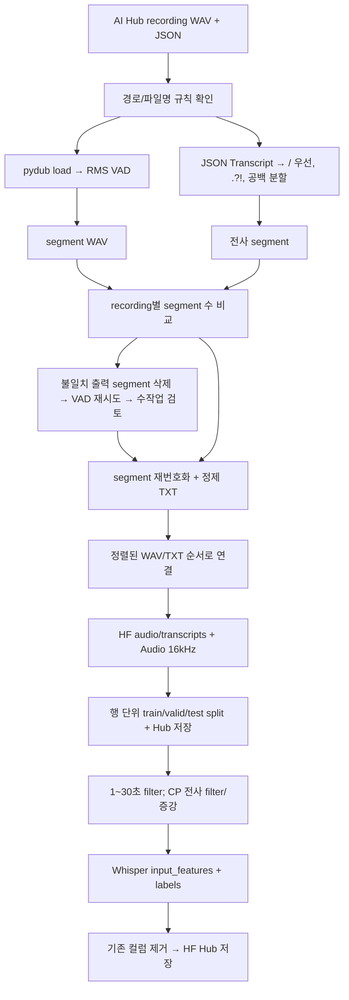

# 선행연구 preprocessing 분석 및 Pilot 원본 검증
확인일: 2026-10-04 (Asia/Seoul)

## 범위와 근거
- 원본 저장소: https://github.com/yoona-J/Diagnosis-Aware_Multitask_Fine-Tuning_of_Whisper_for_DSR
- 분석 커밋: 4624249a217e85ff91752c2f689eca4ede15686a (main의 확인 당시 HEAD)
- 논문: https://www.sciencedirect.com/science/article/pii/S0167639326000415
  - 403 Forbidden으로 본문 미확인. 논문의 설명과 실제 코드가 일치한다고 단정하지 않는다.
- Preprocess 3개, Fine-Tuning 4개 노트북과 관련 README를 정적으로 읽음. 노트북은 실행하지 않음.
- 모든 Cn:Ln 표기는 원본 노트북의 전체 cells 배열을 1부터 센 셀 번호와 해당 셀 source 내 줄 번호. 실행 번호(execution_count)가 아님.
- reference_code 폴더에 커밋 고정 원본 .ipynb 및 코드 셀만 추출한 .code.txt를 저장했다.
- Drive에서는 파일 목록, 약 578KB all_metadata.csv, JSON 13개만 확인했다. WAV 본문/헤더를 읽거나 다운로드하지 않았다.
- 기존 CSV/선정 파일은 수정하지 않았다. preprocessing, feature extraction, split, 학습, Hub 업로드는 실행하지 않았다.

## 실제 코드 파일
공통 디렉터리: Preprocess/
- [Distribution]Preprocessing_Stroke.ipynb
- [Distribution]Preprocessing_Cerebral_Palsy.ipynb
- [Distribution]Preprocessing_Peripheral_Neuropathy.ipynb

위 3개 모두 C10/C11의 최초 RMS VAD, C13의 전사 분할, C15~C24의 수량 비교 및 재시도,
C26의 재번호화, C30/C31의 TXT 저장 구조와 VAD 호출 파라미터가 확인된다.

Whisper/Hugging Face 단계:
- Fine-Tuning/[Distribution]FineTuning_Stroke.ipynb: C3~C18
- Fine-Tuning/[Distribution]FineTuning_Peripheral_Neuropathy.ipynb: C3~C19
- Fine-Tuning/[Distribution]FineTuning_Cerebral_Palsy.ipynb: C3~C24 (증강 분기 포함)
- Fine-Tuning/[Distribution]FineTuning_GeneralModel.ipynb: C3~C14 (세 질환 통합)

고정 커밋 코드 링크:
- [Stroke 원본 전처리](https://github.com/yoona-J/Diagnosis-Aware_Multitask_Fine-Tuning_of_Whisper_for_DSR/blob/4624249a217e85ff91752c2f689eca4ede15686a/Preprocess/%5BDistribution%5DPreprocessing_Stroke.ipynb)
- [Cerebral Palsy 원본 전처리](https://github.com/yoona-J/Diagnosis-Aware_Multitask_Fine-Tuning_of_Whisper_for_DSR/blob/4624249a217e85ff91752c2f689eca4ede15686a/Preprocess/%5BDistribution%5DPreprocessing_Cerebral_Palsy.ipynb)
- [Peripheral Neuropathy 원본 전처리](https://github.com/yoona-J/Diagnosis-Aware_Multitask_Fine-Tuning_of_Whisper_for_DSR/blob/4624249a217e85ff91752c2f689eca4ede15686a/Preprocess/%5BDistribution%5DPreprocessing_Peripheral_Neuropathy.ipynb)
- [Stroke HF 준비](https://github.com/yoona-J/Diagnosis-Aware_Multitask_Fine-Tuning_of_Whisper_for_DSR/blob/4624249a217e85ff91752c2f689eca4ede15686a/Fine-Tuning/%5BDistribution%5DFineTuning_Stroke.ipynb)
- [Cerebral Palsy HF 준비](https://github.com/yoona-J/Diagnosis-Aware_Multitask_Fine-Tuning_of_Whisper_for_DSR/blob/4624249a217e85ff91752c2f689eca4ede15686a/Fine-Tuning/%5BDistribution%5DFineTuning_Cerebral_Palsy.ipynb)

## 요청한 15개 항목에 대한 코드 근거
아래 P는 Preprocessing_Stroke, F는 FineTuning_Stroke를 의미한다. 다른 질환에서 달라지는 부분은 따로 명시한다.

| 항목 | 확인한 처리 | 파일/셀/줄 |
|---|---|---|
| 1. WAV/JSON 최초 입력 | BASE_PATH 및 질환별 AUDIO/LABEL 폴더 설정. 비재귀 glob *.wav, JSON 폴더 열거 | P C4 L1~15, C10 L54~76, C13 L10~15 |
| 2. WAV loading | pydub.AudioSegment.from_file. millisecond 인덱스로 slicing 후 segment.export(format=wav) | P C10 L76, L82~86 |
| 3. sampling rate 처리 | 최초 VAD 코드에는 sample rate 설정/검사, mono 강제 변환 없음. 원본 AudioSegment 설정을 사용 | P C10 전체, C21 전체 |
| 4. resampling/target | HF Audio(sampling_rate=16000)로 decode 시 16kHz 입력을 요청. 별도 librosa.resample 호출 없음 | F C13 L1~2, C15 L1~3 |
| 5. segmentation | 각 recording의 frame RMS 평균 × alpha 미만을 silence로 분류. 연속 긴 silence를 경계로 분할/제외 | P vad_segment_by_energy, C10 L13~51 |
| 6. 길이 기준 | 고정 segment 길이/최대 30초 분할 없음. 500ms frame, 5초 silence, alpha .3. 재시도는 600ms/3초/.4 | P C11 L1~7, C22 L9~16 |
| 7. silence/VAD | RMS 기반 직접 구현 VAD. 짧은 silence는 남을 수 있음. Silero/WebRTC VAD 아님. noisereduce는 import만 하고 호출하지 않음 | P C10 L10~51, C21 L10~48 |
| 8. JSON transcript | pd.read_json(..., orient=columns), Transcript.iloc[0]을 str 변환 후 strip. 수량 비교 함수에서는 json.load와 data[Transcript] | P C13 L14~15, C15 L8~21, C30 L12~13 |
| 9. 전사 정제 | /가 하나라도 있으면 /만 분할; 없으면 .?!; 모두 없으면 whitespace. 빈 조각 제거. TXT 저장 시 + * ( ) ? ! , . ~ - 작은따옴표 제거 | P C30 L15~22, C31 L22~25 |
| 10. 짧고 긴 입력 제외 | 원본 recording 길이 필터 없음. HF decode 후 sample 수 16000~480000만 유지 = 16kHz에서 inclusive 1~30초 | F is_valid_audio C15 L5~11; Peripheral C16 L5~11; General C11 L5~11 |
| 11. 오류 제외 | 파일 없음/ID 정규식 불일치는 skip. 첫 WAV loading은 try/except 없음. 재시도 WAV loading 실패/VAD 결과 없음은 skip. JSON 수량 검사 예외는 review로 기록 | P C10 L63~71; C15 L39~67; C21 L60~86 |
| 12. Whisper feature | openai/whisper-small FeatureExtractor, Korean/transcribe Tokenizer. audio array로 input_features, transcripts로 labels 생성 | F C3 L1~2, C4 L4~5, prepare_dataset C16 L1~7 |
| 13. 저장 컬럼 | 중간 HF dataset: audio, transcripts. map에서 원래 컬럼 모두 제거하므로 최종: input_features, labels. filename/speaker_id/disease 없음 | F C13 L1~2, C17 L1~6 |
| 14. HF 저장 | Dataset.from_dict → cast_column(Audio) → DatasetDict → push_to_hub. Hub 재로딩 후 filter/map, processed_dataset.push_to_hub. save_to_disk 없음 | F C12~C18 |
| 15. split | segment WAV/TXT를 연결한 뒤, 길이 filter/feature 생성 전에 행 단위 90% train, 나머지를 50:50으로 valid/test(대략 각 5%). seed/화자 grouping/stratify 인자 없음 | F C13 L4~11; General C8 L8~15 |

추가 확인:
- Cerebral Palsy의 is_valid_audio는 1~30초 외에 strip한 transcript 길이 >=2와 not isspace를 요구한다 (C19 L5~16).
- Cerebral Palsy는 train만 확률 .5의 noise injection(noise_level=.005), 확률 .5의 speed_perturb를 적용하고 원본 train과 증강 train을 concat한다 (C18~C21).
- speed_perturb는 원래 sr→임의 new_sr→원래 sr의 두 resample 호출이다. 함수 이름만으로 실제 재생 속도 변화가 올바르게 구현되었다고 단정하지 않는다.
- C20과 C21에 train 증강을 별도로 두 번 계산하며, 최종 C23은 merged_dataset을 사용한다. 증강용 random seed는 명시되지 않는다.
- PyKoSpacing 설치 명령은 있지만, 검토한 preprocessing/feature 준비 셀에서 띄어쓰기 교정 호출은 없다.
- 모델 FeatureExtractor 내부 FFT/Mel/padding 설정은 노트북에서 직접 지정하지 않고 모델 기본 설정에 맡긴다. 라이브러리 버전이 고정되지 않아 실행 환경 확인이 필요하다.
- split은 원본 AI Hub의 Training/Validation 구분을 그대로 사용하는 방식이 아니다. 같은 화자의 segment가 여러 split에 들어가는 것을 방지하는 코드는 없다.

## 실제 pipeline 순서도


| 단계 | 입력 | 처리 | 출력 | 실패/제외 조건 |
|---|---|---|---|---|
| 원본 열거 | 질환별 WAV/JSON 로컬 폴더 | 경로와 ID-xx-xx-N-... 규칙 확인 | recording 목록 | missing WAV, 파일명 정규식 실패 skip; glob 비재귀 |
| VAD | 원본 recording WAV | 500ms/5s/.3 RMS silence 분할 | output_PN_{recording_suffix}_{index}.wav | 첫 decode 오류는 중단 가능. 빈 입력은 평균 RMS 계산 오류 가능 |
| 전사 분할 | 원본 JSON Transcript | /→.?!→whitespace의 우선순위, strip/빈 문자열 제거 | 전사 segment 목록 | 최초 JSON parse 오류를 전체적으로 skip하는 안전장치 없음 |
| 수량 검토 | 같은 recording의 WAV segment/전사 수 | gap>0 또는 예외면 review 목록 | review CSV/TXT | 개수 일치는 의미/시간 정렬의 증거가 아님 |
| VAD 재시도 | review 대상 원본 WAV | 기존 생성 segment 삭제, 600ms/3s/.4로 재분할 | 새 segment와 재검토 목록 | decode 실패/no segments skip. 잔여 불일치는 README상 수작업 처리 필요 |
| TXT 생성 | 정리된 JSON 전사 | recording마다 연속 번호, 정제 regex | output_PN_..._i.txt | 규칙 불일치 skip. 일부 초기 셀은 폴더 모든 항목을 JSON처럼 읽음 |
| pair/HF 준비 | segment WAV와 TXT | 각각 정렬해 positional pairing, TXT 첫 줄 읽음, Audio(16000) | audio/transcripts Dataset | 개수 다르면 DataFrame 대입 실패 가능. 동일 개수여도 파일명 대응을 검사하지 않음 |
| split | segment 단위 Dataset | .1 holdout, holdout의 .5 test | train/valid/test DatasetDict | speaker 분리 없음. 비율은 rounding/filter로 달라질 수 있음 |
| filter | 16kHz decoded segment | 길이 16000~480000 samples 유지; CP는 전사 추가 검사 | filtered DatasetDict | <1초/>30초 제거. 다른 decode 오류에 대한 명시적 catch 없음 |
| feature/save | filtered audio/transcripts, CP train 증강 | FeatureExtractor/Tokenizer map, 원래 컬럼 제거 | input_features/labels, Hub dataset | 실패 map에 대한 catch 없음. 토큰 최대 길이 filter/truncate 명시 없음 |

주의: 재시도에서 기존 생성 WAV를 삭제하는 로직은 원본 WAV 삭제가 아니다. 이번에는 어떤 삭제/재시도도 실행하지 않았다.
고정 30초 청크로 긴 VAD segment를 재분할하는 단계는 공개 코드에서 확인되지 않는다. 30초 초과 segment는 HF filter에서 버려진다.

## 공개 코드의 재현 한계 / 그대로 실행하기 전 확인
1. F Stroke/Peripheral/CP C9는 fluency_analysis.csv로 filtered_audio_list/filtered_text_list를 계산하지만,
   다음 C10은 unfiltered raw_data_list/labeled_data_list로 DataFrame을 만든다.
   따라서 exclusion이 실제 HF 입력에 적용되었다고 말할 수 없다.
2. General C4는 all_audio_files/all_text_files를 만들지만 C6는 정의되지 않은 raw_data_list/labeled_data_list를 참조한다.
   깨끗한 kernel에서 이 부분은 연결되지 않는다. General 설치 셀에는 PyKoSpacing.gitm 오타도 있다.
3. TXT/WAV는 File_id key join이 아니라 독립 정렬 후 같은 위치로 연결된다. 누락/이름 차이/수작업 삭제가 있으면 label misalignment 가능.
4. 수량 일치 검사는 alignment 검증이 아니다. phonetic annotation의 /가 하나 있어도 전사 전체를 /로만 나눠 문장/단어 수와 크게 어긋날 수 있다.
5. VAD .3/.4, frame 크기, silence 길이는 코드 값 그대로다. 다른 방법(VAD 모델/ASR alignment)을 추가하면 선행연구 동일 처리라고 부를 수 없다.
6. 잔여 mismatch의 실제 수작업 수정 내용과 개별 파일 최종 처리 이력은 공개 노트북만으로 복원되지 않는다.
7. Fine-Tuning 설치 셀은 datasets==2.20.0 후 최신 git transformers 및 datasets upgrade를 수행한다.
   README의 환경 버전과 완전히 동일한 설치 결과를 보장하지 않는다.

## 우리 AI Hub 구조와 비교
| 대상 | 선행연구 코드/README | 현재 Drive |
|---|---|---|
| 말초성 뇌신경장애 | Training/TS01/26 ↔ TL01/26, 변수 폴더명 Peripheral_Neuropathy | TS01_뇌신경장애 ↔ TL01_뇌신경장애; 확인 샘플 Type=02/Subcategory2=26 |
| 뇌성마비 | Validation/VS01/13 ↔ VL01/13 | VS01/VL01 아래 13.뇌성마비 |
| 뇌졸중 | Validation/VS01/11 ↔ VL01/11 | VS01/VL01 아래 11.중풍 |
| 추가 장애 유형 | TL02/TL03 질환을 처리하는 전용 노트북 없음 | 언어청각/후두 dataset이 존재 |

그대로 적용 가능한 요소:
- ID-두자리-두자리-N-... 원본 파일명 패턴; 파일명 기반 output_PN_ 규칙.
- JSON Transcript 및 WAV loading/VAD/전사 분할 함수의 기술적 입력 형태.
- 후속 16kHz Audio decode 및 Whisper feature/tokenizer 준비 원리.

수정/설정 필요한 요소:
- BASE_PATH와 질환별 AUDIO/LABEL/OUTPUT, flat glob 입력에 맞는 Pilot 작업 폴더 설정.
- 현재 Drive의 질환별 하위 폴더 탐색 또는 선정한 recording만 별도 작업 폴더로 배치.
- HF 업로드/학습/split 셀을 실행하지 않는 단계별 제한.
- positional pairing과 filtered list 미적용 등 공개 코드 문제를 어떻게 다룰지 명시적 결정 및 변경 이력.
- 기존 speaker_id/원본 File_id/segment index/시작끝 시간을 별도 manifest에 보존할 계획. 원래 최종 HF 컬럼에는 이 정보가 없음.

확인 필요한 요소:
- 우리 장애 그룹은 dataset 폴더 기준. 개인 진단은 Disease_info로 판단해야 함.
- 추가 TL02/TL03에 같은 알고리즘을 적용하는 것은 방법의 확장 테스트이며, 선행연구의 동일 질환 cohort 재현은 아님.
- 추천 LHJ는 Type01/Subcategory1=15이며, 원래 연구의 11/13 cohort와 다름.
- JSON Meta_info SamplingRate가 실제 WAV header와 같은지 확인 필요. 현재 metadata만으로 실제 WAV SR/채널/bit depth를 확정하지 않음.
- 수작업 수정 이력, 환경 버전, label/audio alignment, /의 의미.

## Pilot 15명 실제 목록/통계 대조
근거:
- 로컬 results/pilot_selection/pilot_speakers.csv.
- Drive 00_data/mini_dataset/dataset_analysis/all_metadata.csv 전체의 file_id/sex/age/dataset/플레이시간.
- VS01/VL01의 12/15, TS02/TL02의 27(1~3)/28, TS03/TL03의 31/32(1~2)/34(1~6) 직접 자식 목록.
- 조사한 30개 하위 폴더 모두 반환 항목 수 < 요청 limit1000 (192~643)였음.
- 목록 snapshot은 Pilot의 15개 speaker_code로 좁혀 저장했으며 최종 검증은 코드/성별/나이 canonical 정확 일치와 dataset으로 수행.
- recording 수는 고유 원본 WAV 파일명 수를 의미한다. 동일 내용의 별도 파일이 독립 recording인지 여부는 확정하지 않음.

| speaker | recording(파일명) | 실제 WAV | 실제 JSON | metadata duration(분) |
|---|---:|---:|---:|---:|
| LKE_M_65 | 2 | 2 | 2 | 212.407001 |
| CMJ_F_76 | 7 | 7 | 7 | 403.608396 |
| LHJ_F_79 | 7 | 7 | 7 | 136.169794 |
| KWY_M_64 | 13 | 13 | 13 | 288.829732 |
| BCS_F_65 | 16 | 16 | 16 | 295.979273 |
| KMJ_F_25 | 2 | 2 | 2 | 76.291513 |
| JHK_M_34 | 8 | 8 | 8 | 278.682481 |
| JSM_M_35 | 9 | 9 | 9 | 242.195187 |
| HJI_F_49 | 11 | 11 | 11 | 798.447998 |
| LUA_F_47 | 12 | 12 | 12 | 1492.207353 |
| KYY_M_58 | 2 | 2 | 2 | 24.732202 |
| LYB_F_22 | 8 | 8 | 8 | 263.480011 |
| SYR_F_41 | 11 | 11 | 11 | 343.055403 |
| HMR_F_28 | 15 | 15 | 15 | 449.669732 |
| HMJ_F_30 | 16 | 16 | 16 | 475.155336 |

총 139 WAV/139 JSON/139 파일명 대응 쌍.15명 모두 summary n_files와 고유 WAV 파일명 수가 같고,
total_duration_min은 all_metadata의 play_time 합계/60과 부동소수점 반올림 수준에서 같음.
이 결과는 recording 단위 통계와 일치한다는 검증이며, speaker_summary 생성 코드 자체의 provenance 증명은 아님.
길이는 WAV를 decode한 실제 측정이 아니라 metadata 기반이다.

JSON 샘플 확인: LHJ 7개, LKE 2개, KMJ 2개, KYY 2개 (총13).
각 JSON의 playTime은 해당 all_metadata play_time과 1e-6초 미만 오차로 일치.
- LKE 두 WAV는 서로 다른 이름이나 각각 562,028,968 bytes로 크기가 같고, 두 JSON playTime도 6372.210022675737초(106.2035분)로 같다.
  따라서 합계212.407분은 단위 변환 실수가 아니다. JSON 전사는 완전히 같지는 않다.
  WAV hash/header 없이 동일 오디오인지 판단할 수 없으므로 중복 의심으로만 기록.
- LKE 두 전사는 길이 약3만 문자이며 / 우선 분할 결과 각2개. 실제 VAD segment 수와는 아직 대조하지 않았지만 첫 테스트로 부적합.
- KMJ의 03 recording도 / 우선 분할 결과2개. n_files만 낮다고 전처리 작업이 간단한 것은 아니다.
- KYY 01-01은 whitespace 분할60개, LHJ 03은 punctuation 분할27개.
- 모든 13개 JSON 샘플의 Meta_info SamplingRate는48000. 실제 WAV header rate 미확인.

## 첫 실행 추천 3명 — 계획만
| 장애 그룹 | 화자/volume | 첫 recording 후보 | metadata 길이 | 근거 및 남은 확인 |
|---|---|---|---:|---|
| 뇌신경장애 | LHJ_F_79 / medium | ID-01-15-N-LHJ-03-F-79-KK.wav + 동일 stem JSON | 3.2834분 | 7개 중 짧은 파일. JSON 전사27개, Type01/Subcategory1=15 확인 |
| 언어·청각 | JSM_M_35 / medium | ID-02-27-N-JSM-01-01-M-35-KK.wav + 동일 stem JSON | 5.6559분 | 9개 중 짧은 파일. WAV/JSON 존재 및 all_metadata 길이 확인. 이 JSON 내용은 아직 읽지 않았으므로 전사 규칙 확인 필요 |
| 후두장애 | KYY_M_58 / low | ID-03-31-N-KYY-01-01-M-58-KK2.wav + 동일 stem JSON | 11.0718분 | 2개 중 짧은 파일. JSON whitespace 전사60개, Type03/Subcategory3=31 확인 |

이 추천은 기존 Pilot CSV 수정이 아니며, 실행 우선순위 제안이다.
세 화자의 모든 파일을 처음부터 실행하지 말고 위 recording 각1개(총3 WAV/3 JSON, metadata 약20.011분)로 시작하는 계획을 권장.
LHJ=기타및복합 cohort이므로 원래 연구의 뇌졸중/뇌성마비 재현이라고 명명하지 않는다.

## 다음 실행 전 필요한 것
1. JSM 첫 recording의 JSON 내용/전사 분할 가능 여부 확인.
2. 추천 3개 원본 WAV/JSON의 소량 다운로드 계획과 정확한 Drive ID/경로 manifest.
   WAV는 이번에 받지 않았으며 실행 단계에서만 받을 것.
3. WAV header sample rate/channel/bit depth/duration 검증, JSON playTime과 실제 길이 대조.
4. source WAV 보호, 생성물 전용 폴더, recording별 실패/segment 시간/개수/최종1~30초 유지율 기록.
5. 원래 파라미터(.3,500ms,5초; 재시도 .4,600ms,3초) 및 전사 정제 regex를 그대로 유지할지,
   공개 코드 pairing/list 오류만 별도 수정할지 결정하고 차이를 기록.
6. mismatch는 실패로 계수하고 자동 fuzzy alignment/전사 임의 수정은 하지 않을 것.
7. 실행 환경과 pydub/ffmpeg/datasets/transformers 모델 설정 버전 고정.
8. Pilot 시간/성공률 검증 시 원래 preprocessing에서의 VAD 성공과 label count 일치,
   HF1~30초 적합률을 별도 지표로 기록. split/업로드/학습은 별도 단계에서 결정.

## 저장된 검증 코드/자료와 실행
- inspect_reference_and_metadata.py: 고정 커밋 코드 다운로드/정적 코드 셀 추출 및 all_metadata와 Pilot CSV 비교.
- verify_drive_inventory.py: 저장된 파일 목록의 정확 canonical-ID 및 dataset 비교.
- inspect_json_samples.py: 저장된 JSON의 playTime/전사 분할 규칙 진단. WAV 처리 없음.
- all_metadata_drive.csv: Drive 소형 정리 metadata 사본.
- pilot_drive_inventory.json: 코드 필터를 거친 파일명/Drive ID/크기 snapshot (WAV 본문 없음).
- pilot_metadata_audit.json, pilot_drive_audit.json, json_sample_audit.json: 검증 결과.
- json_samples/: JSON13개. reference_code/: 참고 노트북/README 및 코드 셀 추출본.

PowerShell (네트워크 없이 저장된 자료만 재검증):
```powershell
& C:\Users\DS\.cache\codex-runtimes\codex-primary-runtime\dependencies\python\python.exe C:\ieum\scripts\03_preprocessing_pilot\inspect_reference_and_metadata.py --audit-metadata
& C:\Users\DS\.cache\codex-runtimes\codex-primary-runtime\dependencies\python\python.exe C:\ieum\scripts\03_preprocessing_pilot\verify_drive_inventory.py
& C:\Users\DS\.cache\codex-runtimes\codex-primary-runtime\dependencies\python\python.exe C:\ieum\scripts\03_preprocessing_pilot\inspect_json_samples.py
```

